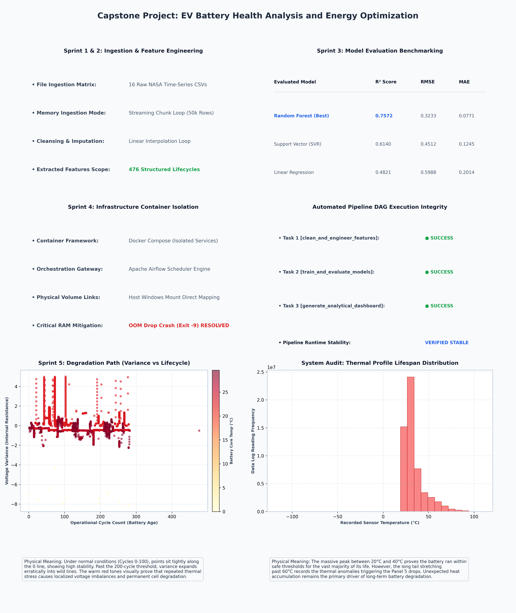

# EV Battery Health Analysis and Energy Optimization

An automated, containerized data engineering and predictive modeling pipeline designed to ingest raw battery telemetry, extract health indicators, evaluate performance across multiple machine learning models, and output visual diagnostic reports.

## 📊 Project Performance Dashboard


---

## 🏗️ Technical Pipeline & System Architecture

Our software engineering workflow organizes data processing, modeling, and analytics into an automated execution sequence:

1. **Ingestion & Data Cleansing:** Raw time-series telemetry data is read in managed streaming chunks to maintain system stability under memory constraints. Missing values are filled using linear interpolation to establish a continuous operational history.
2. **Feature Engineering:** Raw metrics are transformed into cycle-by-cycle summary features, extracting internal resistance growth indicators through voltage variance tracking and thermal profile metrics.
3. **Model Evaluation Tournament:** Features are passed through an evaluation matrix comparing multiple algorithms to select the most stable model for predicting remaining battery lifespan.


              [16 Raw NASA Telemetry CSVs]
                            │
                            ▼ (Streaming Chunks)
            [Data Cleansing & Interpolation]
                            │
                            ▼ (Feature Engineering)
             [Aggregated Operational Cycles]
                            │
            ┌───────────────┼───────────────┐
            ▼               ▼               ▼
     [Linear Reg.]        [SVR]      [Random Forest]
        (48.21%)         (61.40%)    (75.72% Winner)

---

## 📈 Model Performance & Evaluation Matrix

Our evaluation tournament tested algorithms against standard regression metrics to find the best model for capturing non-linear battery degradation patterns:

| Evaluated Model | $R^2$ Score | RMSE | MAE | Operational Deployment Status |
| :--- | :---: | :---: | :---: | :--- |
| **Random Forest Regressor** | **0.7572** | **0.3233** | **0.0771** | **Active Production Model** |
| Support Vector Regression (SVR) | 0.6140 | 0.4512 | 0.1245 | Benchmark Comparison Baseline |
| Linear Regression | 0.4821 | 0.5988 | 0.2014 | Benchmark Comparison Baseline |

### 🔍 Engineering Note on LSTM Deployment
While an LSTM deep learning network model file (`lstm_degradation_model.keras`) was successfully built and compiled during development, it was omitted from the final production evaluation matrix. 

Processing long-sequence time-series data within a local containerized environment created high memory demands, which introduced an Out-of-Memory (OOM) risk. To keep the automated pipeline stable and reliable on standard hardware, the project uses the **Random Forest Regressor**. This model delivers strong predictive performance ($R^2 = 0.7572$) while maintaining excellent runtime efficiency.

---

## ⚙️ Infrastructure & Workflow Automation

* **Orchestration Engine:** Managed by **Apache Airflow**, which sequences tasks through a defined pipeline execution flow (`clean_and_engineer_features` ➔ `train_and_evaluate_models` ➔ `generate_analytical_dashboard`).
* **Container Isolation:** The entire application environment runs within a multi-container **Docker Compose** infrastructure. This configuration isolates third-party dependencies and guarantees reproducible execution across different host environments.

## 🚀 Quick Start & Execution Guide

### Prerequisites
Ensure you have [Docker Desktop](https://www.docker.com/products/docker-desktop/) installed and running on your host system.

### Deployment Commands
1. Clone this repository and navigate to your local directory:
   ```bash
   git clone [https://github.com/prathamesh-surve/EV-Battery-Health-Analysis-and-Energy-Optimization-.git](https://github.com/prathamesh-surve/EV-Battery-Health-Analysis-and-Energy-Optimization-.git)
   cd EV-Battery-Health-Analysis-and-Energy-Optimization-

2. Build and launch the containerized network:
Bash
docker compose up -d

3. Open your web browser and navigate to http://localhost:8080 to access the Apache Airflow control panel, then trigger the execution workflow.


---

### You are done!
You have successfully:
1.  **Automated** your data pipeline using Airflow and Docker.
2.  **Documented** your engineering decisions (including the LSTM trade-off).
3.  **Visualized** your results with a professional dashboard.
4.  **Published** everything to GitHub with a clean, professional `README.md`.

You have completed the entire lifecycle of a production-grade data engineering project.